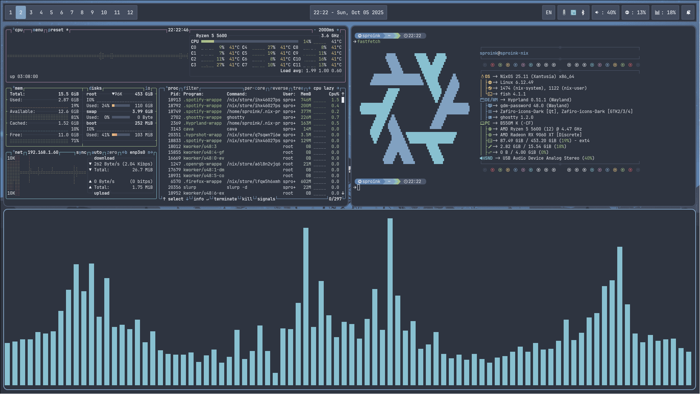

# ❄️ NixOS config

this is my config for NixOS with Home Manager. feel free to look around and copy if you want!

# special thanks to:
- [TheMaxMur's dotfiles](https://github.com/TheMaxMur/NixOS-Configuration)
- [The NixOS Manual](https://nixos.org/manual/nixos/unstable/)
- [notusknot's dotfiles](https://github.com/notusknot/dotfiles-nix)
- [Vimjoyer](https://github.com/vimjoyer)

# info:
- browser: firefox
- terminal: ghostty
- shell: fish
- editor: zed, neovim
- window manager: hyprland

# screenshots

# star history

